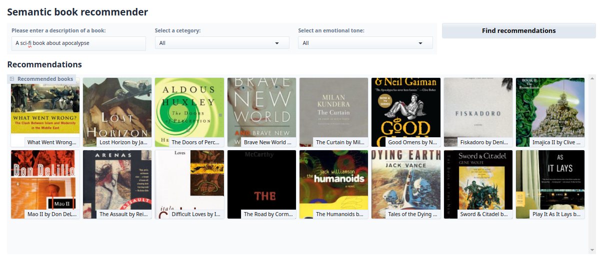
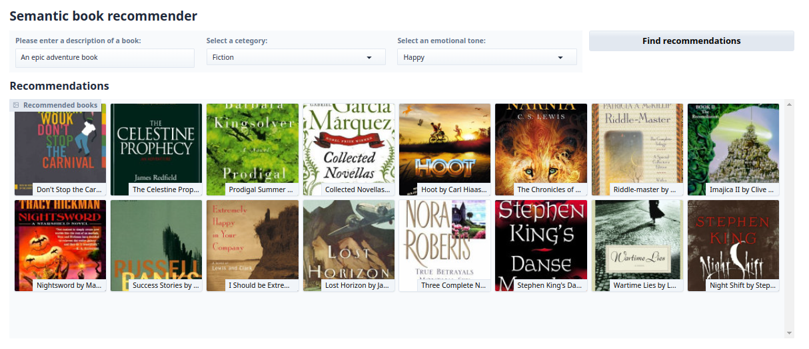

# Semantic Book Recommender

This project is a book recommendation system that suggests book titles based on three key inputs: a user's text query, a selected category, and a desired emotional tone. It features an interactive dashboard built with Gradio.

## Features

- **Semantic Search:** Find books by describing themes, plots, or tone in natural language.
- **Category Filtering:** Filter recommendations by book category (e.g., Fiction, Nonfiction).
- **Emotion-Based Filtering:** Refine results by emotional tone (e.g., joy, sadness, surprise, fear).
- **Interactive Dashboard:** User-friendly interface for exploring recommendations.
- **Rich Metadata:** Recommendations include book cover, title, authors, and a short description.

## Project Structure

```
├── gradio-dashboard.py         # Main dashboard and recommendation logic
├── text_classification.ipynb   # Notebook for category classification
├── sentiment_analysis.ipynb    # Notebook for emotion analysis
├── data_exploration.ipynb      # Notebook for EDA and cleaning
├── no_cover.png                # Default cover image
├── README.md                   # Project documentation
```

## Getting Started

1. **Install dependencies:**
   - Create and activate a virtual environment.
   - Install required packages:
     ```sh
     pip install -r requirements.txt
     ```

2. **Prepare data:**
   - Download 7k Books dataset: 
   ```sh
    import kagglehub

    path = kagglehub.dataset_download("dylanjcastillo/7k-books-with-metadata")
    ```
   - Run `data_exploration.ipynb` to clean and explore the dataset.
   - Use `text_classification.ipynb` and `sentiment_analysis.ipynb` to generate category and emotion labels.
   - Use `vector_search.ipynb` to generate a text file for loading the vector db and to experiment with semantic similarity search.

3. **Run the dashboard:**
   ```sh
   python gradio-dashboard.py
   ```
   - Access the Gradio interface in your browser to start searching for books.

## Usage

- Enter a description of a book or theme in the dashboard.
- Select a category and emotional tone to filter recommendations.
- Browse the recommended books, each with a cover image and summary.

## Notebooks

- [`data_exploration.ipynb`](data_exploration.ipynb): Data cleaning, exploration, and visualization.
- [`text_classification.ipynb`](text_classification.ipynb): Assigns categories to books using zero-shot classification model [bart-large-mnli](https://huggingface.co/facebook/bart-large-mnli).
- [`sentiment_analysis.ipynb`](sentiment_analysis.ipynb): Analyzes book descriptions for emotional content using [emotion-english-distilroberta-base](https://huggingface.co/j-hartmann/emotion-english-distilroberta-base).
- [`vector_search.ipynb`](vector_search.ipynb): Experiments semantic search for book recommendations using ['all-MiniLM-L6-v2'](https://huggingface.co/sentence-transformers/all-MiniLM-L6-v2), LangChain, and Chroma.

## Dataset

- [7k Books with Metadata](https://www.kaggle.com/dylanjcastillo/7k-books-with-metadata) (Kaggle)

## Screenshots



